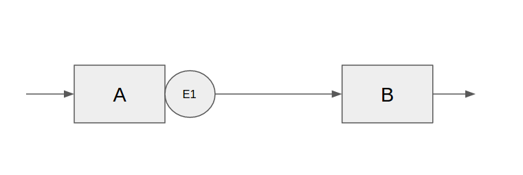
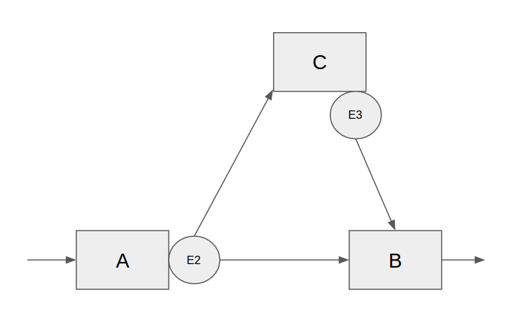
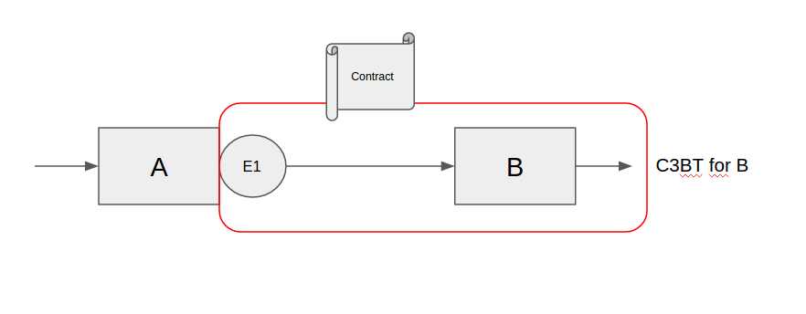
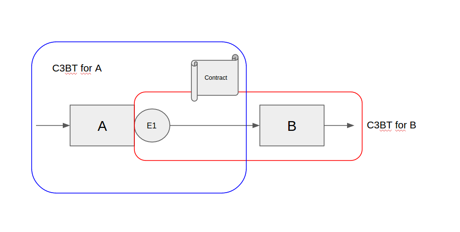

# Testing Microservices: A case study

This repository contains an experiment on how to properly test microservices that are communicating over a message queue.
The implementation is done in Java with Spring Boot, the message queue in question is Kafka.
The principle should work everywhere though.

## Setup

The setup consists of two constellations. We limited ourselves to three services (A,B,C) and three events (E1, E2, E3).
The next two paragraphs will describe the examples that you can see in this project.

### Example 1 - simple A-B communication

This example is the easy use case. Service A exposes a rest endpoint named "triggerE1" accepting POST
requests. Upon triggering it the service emits a message of type E1. This event is consumed by service B.
As soon as B consumes an event of type E1 it will issue a get request to some other service.

### Example 2 - three way communication

This example is the more complicated use case. We have Service A publishing an event of type E2 as soon as
the "triggerE2" endpoint is called.
This event is consumed by service B and C. On receiving event E2 the service C will emit an event of type E3.

The service B will wait for **both** events of type E2 and E3 to appear to trigger another external endpoint.

## The problem

The central problem that exists in a distributed system is how to test it? How can you do changes without breaking the
existing live system and how do you prove that your change actually works?

Currently this is mostly done by having a staging system running that somehow resembles the setup of your live system.
This has multiple disadvantages as you suddenly have a second system of the same complexity to maintain. But then the
load pattern is not the same so your tests on the staging system actually do not reflect the full behaviour of the live
system.

The alternative is to actually divert live traffic to test your change. This approach brings other problems with it.
You have to actually be able to risk live traffic going wrong. You have to synchronize the old versions of the service
that it ignores the traffic that is handled by the new version. Or you insert specific test data into your system which
then has to be distinguished by the application. All of this is doable but not perfect.

## The solution

The solution that we propose with this document is to do `contract based black box testing`.

A contract based black box test (CBBBT or C3B Test [KEB Test]) is a construct that combines consumer driven contract
testing with black box testing. What you are doing is basically creating requirements for certain features on the
consumer side and then documenting these in contracts. These contracts are then used as input for your own blackbox
tests as well as as contract for the producing side.

Lets consider example 1 again.

First we create a C3B test for service B. This test specifies how the event E1 should look like. It uses a DSL to create
requirements for the event structure which also serves as input for the blackbox tests. These blackbox tests verify that
 given a certain E2 the right outgoing behaviour is triggered (in this case calling a rest endpoint).

With this test we can verify that given a certain E2 we will trigger the right action on our side. Great. Now we know
that our service behaves correctly.

The next step now is to get the other side to deliver. To ensure this we create another C3B test for service A.
This time we use the contract from B as verification for the output. Lets say service B confirms to the contract.

## How to run the experiment