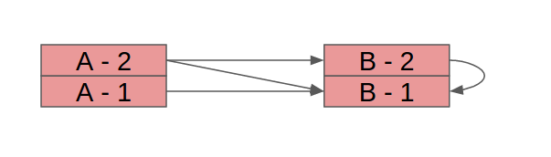
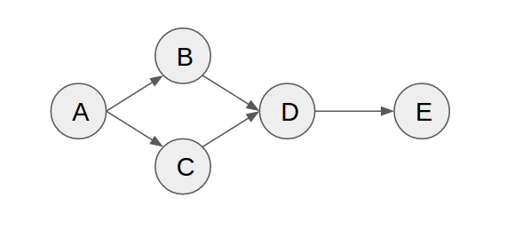
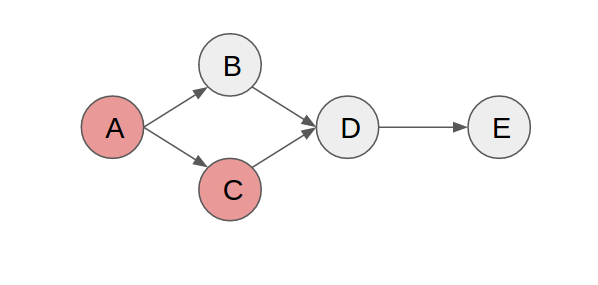
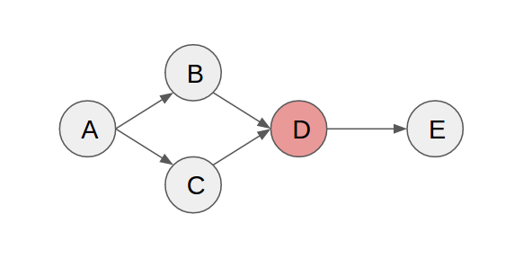
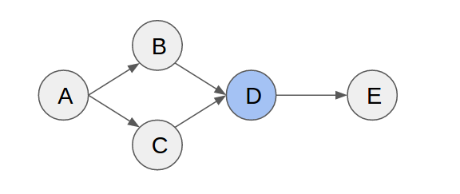
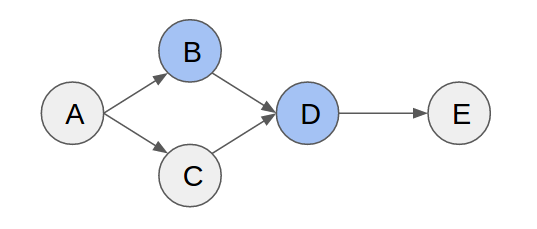
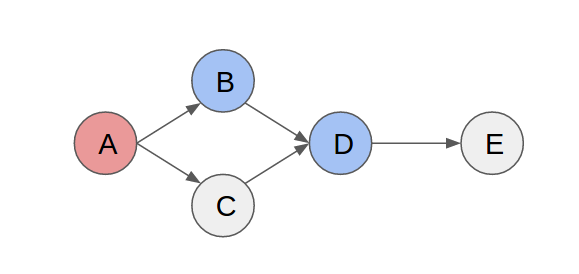
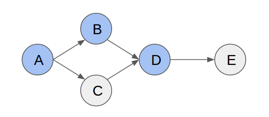
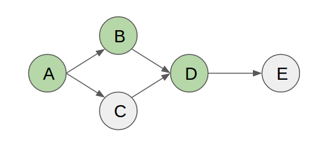

# Testing Microservices: A case study

This repository contains an experiment on how to properly test microservices that are communicating over a message queue.
The implementation is done in Java with Spring Boot, the message queue in question is Kafka.
The principle should work everywhere though.

Table of Contents
=================

  * [Assumptions](#assumptions)
  * [Setup](#setup)
    * [Example 1 - simple A-B communication](#example-1---simple-a-b-communication)
    * [Example 2 - three way communication](#example-2---three-way-communication)
  * [The problem](#the-problem)
  * [The solution](#the-solution)
    * [Making changes](#making-changes)
      * [Additional stability on the producer side](#additional-stability-on-the-producer-side)
    * [How does it work in larger systems?](#how-does-it-work-in-larger-systems)
      * [The simple example visualized](#the-simple-example-visualized)
      * [performing a complex change](#performing-a-complex-change)
  * [How to run the experiment](#how-to-run-the-experiment)

Created by [gh-md-toc](https://github.com/ekalinin/github-markdown-toc)

## Assumptions

It is assumed that you know about [event sourcing](http://martinfowler.com/eaaDev/EventSourcing.html) and
[CQRS](http://martinfowler.com/bliki/CQRS.html).

Furthermore it is assumed that you are using an event sourcing system. This implies a couple of things:

* Microservices do one thing, and one thing only.
* Microservices do not talk to each other. Every services talks only to the message queue or external systems.
* All state is in the message queue.
* Upon crashing a service is restarted and recreates its state from the message queue. No service based state store exists.

TODO: as soon as the theory is complete, revisit this part and verify if the basic assumptions can be loosened or removed
all together.

## Setup

The setup consists of two constellations. We limited ourselves to three services (A,B,C) and three events (E1, E2, E3).
The next two paragraphs will describe the examples that you can see in this project.

### Example 1 - simple A-B communication

This example is the easy use case. Service A exposes a rest endpoint named "triggerE1" accepting POST
requests. Upon triggering it the service emits a message of type E1. This event is consumed by service B.
As soon as B consumes an event of type E1 it will issue a get request to some other service.

### Example 2 - three way communication

This example is the more complicated use case. We have Service A publishing an event of type E2 as soon as
the "triggerE2" endpoint is called.
This event is consumed by service B and C. On receiving event E2 the service C will emit an event of type E3.

The service B will wait for **both** events of type E2 and E3 to appear to trigger another external endpoint.

## The problem

The central problem that exists in a distributed system is how to test it? How can you do changes without breaking the
existing live system and how do you prove that your change actually works?

Currently this is mostly done by having a staging system running that somehow resembles the setup of your live system.
This has multiple disadvantages as you suddenly have a second system of the same complexity to maintain. But then the
load pattern is not the same so your tests on the staging system actually do not reflect the full behaviour of the live
system.

The alternative is to actually divert live traffic to test your change. This approach brings other problems with it.
You have to actually be able to risk live traffic going wrong. You have to synchronize the old versions of the service
that it ignores the traffic that is handled by the new version. Or you insert specific test data into your system which
then has to be distinguished by the application. All of this is doable but not perfect.

## The solution

The solution that we propose with this document is to do `contract based black box testing`.

A contract based black box test (CBBBT or C3B Test [speak KEB Test]) is a construct that combines [consumer driven contract
testing](http://martinfowler.com/articles/consumerDrivenContracts.html) with black box testing. What we are proposing is to
create requirements for certain features on the consumer side and then documenting these in contracts.
These contracts are then used as input for the blackbox tests of the consumer as well as as contract for the producing side.

Lets consider example 1 again.

First we create a C3B test for service B. This test specifies how the event E1 should look like. It uses a DSL to create
requirements for the event structure which also serves as input for the blackbox tests. These blackbox tests verify that
 given a certain E2 the right outgoing behaviour is triggered (in this case calling a rest endpoint).

With this test we can verify that given a certain E2 we will trigger the right action on our side. Great. Now we know
that our service behaves correctly.

The next step is to get the other side to deliver. To ensure this we create another C3B test for service A.
This time we use the contract from B as verification for the output. This is done to ensure service B fulfils  to the
contract.

We now know that given the right impulse (a POST to "triggerE1") in service A will result in the correct event of type
E1 published to the message queue. We also know that B reacts to events of type E1 in the correct way. With these two
tests we can now show that our system actually works as expected. One of the upsides is that you can do this on component
level. You do not have to maintain a staging system where you actually have a copy of your live system up and running.

### Making changes

So far we only discussed how it works for a static system. As we know systems are never static. Everything is changing all
the time. In this paragraph we will be discussing how to make changes to such a system and still ensuring that it works.

First lets look at the current situation:

We have service B in version 1. For the sake of simplicity the version of B will always be the same as the current
version of the contract (B in version 1 means contract with version 1). **A consumer always has to fulfil its own
contract**. Service A in version 1 fulfils the contract of B (represented by the arrow).
This means we can deploy both services together and they can interact. The tests described above are showing us that
this works.

Now the requirements for B change. We have to change the behaviour of the service in a way that actually affects the
contract. This results in a new version of the contract being published.

The first thing we have to make sure is that our consumer is backwards compatible. As the old events will stay in the
history this is the only way to make sure that B is still able to consume the whole history of events without struggling.

Now that we know our consumer will still work we can run the tests for A again and discover that the producer is not
fulfilling the new contract.

We have to create a new version of service A that fulfils the new version of the contract.

Now we have a new version of both services which again can communicate with each other.

#### Additional stability on the producer side

In theory it is enough for the producer to fulfil the current contract. We still recommend to use a stronger rule
for stability.

The problem with the described approach is that there is no fallback in case you have to roll back the consumer after
the new version of the producer is live. To make sure that you only have to rollback one service and therefore contain
the changes to a minimum we recommend to also let the producer fulfil at least the next older version of the consumer
contract.

This way we can always be sure that the producer is emitting events that can be understood and that the consumer is able
to work with the current events and the ones in the history, even if you have to rollback the consumer to the previous
version.

You can go even stronger from here and force the producer to fulfil all versions of all contracts of all consumers.
this forces full backwards compatibility, which generally helps to keep the system evolvable. Also it ensures that
the system still works even if your current consumer relies on features that are not present in the current contract
but only in older versions. This in general is an error in the design then, but avoidable with this technique.

The exact tradeoffs here are highly individual and depend solely on the situation at hand.

### How does it work in larger systems?

The interesting thing about this approach is that it scales with your system. So far we only covered the approach for
two services talking to each other. But in fact it works for infinitely large systems.

Lets assume this system setup (arrows mark a producer/consumer relation based on events):

#### The simple example visualized

The situation described above is similar to a change in service C. It would affect the contract between A and C and in
consequence leading to new versions for C and A being deployed.

#### performing a complex change

Lets consider the worst caase scenario: A change in the requirements of D that actually effects all services except C.

We adapt service D to the new requirements and thus create a new version of the contract to B and C. We do **not**
however have to touch E as the contract is not violated and we are still fulfilling it.

To verify that our change is good we have to also check the producers of the events we are consuming. Upon running the
tests of B and C we discover that C still works but the contract with B is broken.

We now also create a new version of B that fulfils the contract with D.

As we changed B we also have to run the tests of A. We discover that they also fail and the contract is not fulfilled anymore.

So we create a new version of A that fulfils the contract with B.

Now that all services have a new version we can actually deploy them.

The ordering of deploying the services depends on which type of backwards compatibility we have chosen for the producers.
If we only implement the current version of the contract we have to follow the path of changes. If we actually implemented
at least the current and the second oldest contract we can roll out the services in a random order.

In the end we should have all services live in the new version.

The appealing part is that for none of the changes we actually had to run a staging system or touch the live system.
All of this can be done on the machine of the developer working on the feature on unit/integration test level.

## How to run the experiment